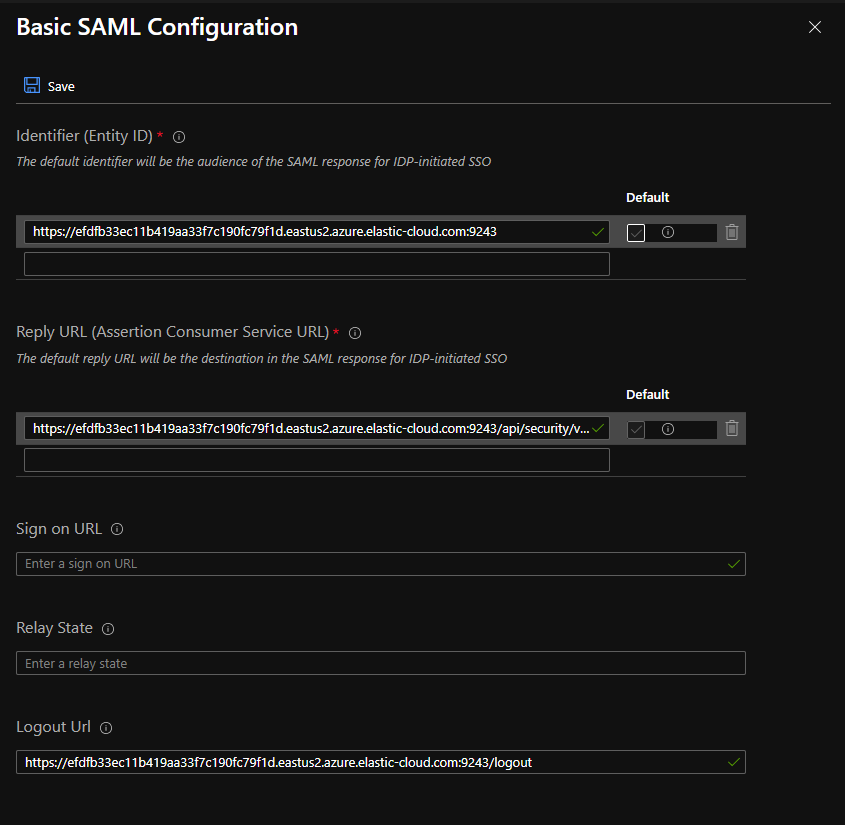
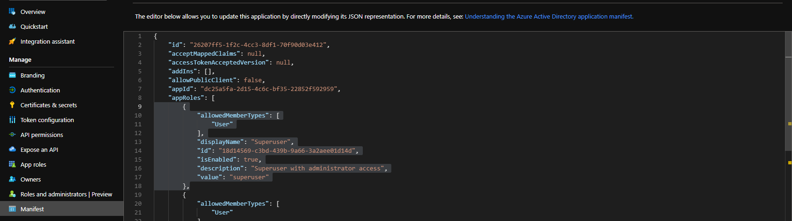
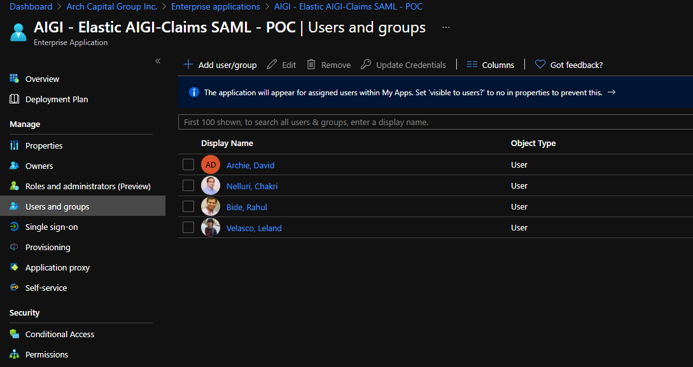

# Elastic Search/ Kibana SAML Integration

1. Create Enterprise Application guided by EA reference naming convention
2. Configure Enterprise Application, Select Single Sign-on

    

3. Go to Application Registration > Navigate to the SP with the same name of the Enterprise Application created to add appRoles. From the App go to manifest

    

    Add from the App Role block
    
    ```json
        {
            "allowedMemberTypes": [
                "User"
            ],
            "displayName": "Superuser",
            "id": "18d14569-c3bd-439b-9a66-3a2aee01d14d",
            "isEnabled": true,
            "description": "Superuser with administrator access",
            "value": "superuser"
        }
    ```
4. From Enterprise application , Configure User and Groups

    

5. Create the SAML realm and Apply to Cluster Configuration

    - Prepare the template, it should be:

    ```yml
        xpack.security.authc.realms.saml.saml_aad:
          order: 2
          idp.metadata.path: "<Azure App Federation Metadata Url>"
          idp.entity_id: "<Azure AD Identifier>"
          sp.entity_id:  "<Kibana Url and port>"
          sp.acs: "<Kibana Url and port>/api/security/v1/saml"
          sp.logout: "<Kibana Url and port>/logout"
          attributes.principal: "http://schemas.xmlsoap.org/ws/2005/05/identity/claims/name"
          attributes.groups: "http://schemas.microsoft.com/ws/2008/06/identity/claims/role"
          attributes.name: "http://schemas.microsoft.com/identity/claims/displayname"
          attributes.mail: "http://schemas.xmlsoap.org/ws/2005/05/identity/claims/emailaddress"
    ```

    - Go to Elastic Cluster Instance, edit configuration (elasticsearch.yml)
        - Apply the SAML realm template
        - save the configuration to Elastic Cluster
    - Go to Kibana Configuration, edit configuration (kibana.yml)
        - Apply the SAML realm

        ```yml
            xpack.security.authProviders: [ saml, basic ]
            server.xsrf.whitelist: [ /api/security/v1/saml ]
            xpack.security.public.protocol: "<Kibana URL protocol>"
            xpack.security.public.hostname: "<Kibana URL hostname>"
            xpack.security.public.port: <Kibana URL public port>
        ```

6. Configure role mappings
    - Go to API Console
    - Run PUT /_security/role_mapping/saml-superuser
    - Write JSON body

        ```json
            {
              "roles": [ "superuser" ],
              "enabled": true,
              "rules": {
                "all": [
                  { "field": { "realm.name": "saml_aad" } },
                  { "field": { "groups": "superuser" } }
                ]
              }
            }
        ```
